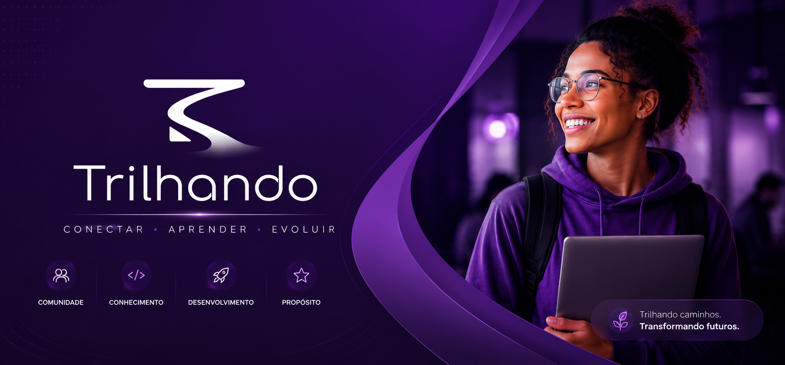

<div align="center">

</div>

#  🚀 Conheçam a Plataforma Trilhando

> **"Muitos jovens não precisam apenas de uma vaga. Eles precisam saber qual caminho seguir para chegar até ela."**

O **Trilhando** é uma plataforma desenvolvida para orientar jovens em início de carreira, conectando aprendizado, desenvolvimento de competências e oportunidades profissionais em um único lugar.

Nosso objetivo é reduzir a distância entre a qualificação e o mercado de trabalho, oferecendo trilhas de aprendizagem que ajudam o usuário a entender quais habilidades desenvolver para alcançar a profissão desejada.

---

## ✨ Funcionalidades

* 📚 Trilhas de aprendizagem por área profissional;
* 🎯 Mapeamento das competências exigidas pelo mercado;
* 🎓 Indicação de recursos gratuitos para estudo;
* 💼 Divulgação de oportunidades relacionadas à área escolhida;
* 🚀 Orientação para o desenvolvimento profissional.

---

## 🛠️ Tecnologias

Este projeto foi desenvolvido com:

* HTML5
* CSS3
* JavaScript
* EmailJS
* Bootstrap icons


---

## 📁 Estrutura do projeto

```text
trilhando/
├── .vscode/
├── assets/
│   ├── icons/
│   │   └── icon.png
│   └── images/
├── css/
│   ├── global.css
│   ├── inicio.css
│   ├── oportunidades.css
│   ├── sobre.css
│   └── trilhas.css
├── js/
│   ├── global.js
│   ├── menu.js
│   ├── oportunidades.js
│   ├── sobre.js
│   └── trilhas.js
├── index.html
├── oportunidades.html
├── sobre.html
├── trilhas.html
├── README.md
```

---

## 🚀 Como executar

1. Clone este repositório:

```bash
git clone https://github.com/Trilhando/Trilhando.github
```

2. Abra a pasta do projeto.

3. Execute o arquivo `index.html` em seu navegador.

---

## 👥 Equipe

Este projeto é desenvolvido como parte de um Projeto Integrador por estudantes comprometidos em criar soluções que gerem impacto social por meio da tecnologia.

---

## 🌍 Objetivos de Desenvolvimento Sustentável

O Trilhando está alinhado aos seguintes ODS da ONU:

* 📖 ODS 4 — Educação de Qualidade
* 📈 ODS 8 — Trabalho Decente e Crescimento Econômico
* 🤝 ODS 10 — Redução das Desigualdades

---

## 💡 Nossa visão

Acreditamos que encontrar uma profissão não deve ser um processo baseado apenas em tentativa e erro.

Queremos ajudar jovens a descobrir caminhos, desenvolver competências e conquistar oportunidades de forma mais consciente.

Porque uma oportunidade começa muito antes da contratação.

Ela começa quando alguém encontra direção.
